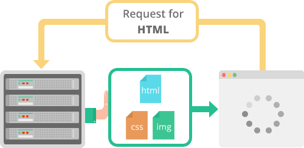

# 개요
기존 HTTP1 (1.1)이 가지고 있던 구조적 문제를 해결하기 위해 새롭게 정의한 프로토콜. google의 SPDY의 프로토콜을 대부분 개승함.

## 주요 목표
 * 최종사용자의 성능향상!

## 설명

### HTTP 1.0


  - 동시전송 불가 (순차적 진행)
  - Head of line blocking
    - 먼저 진행중인 resource loading 이 오래 걸릴경우 다음 resource 딜레이 됨
  - Round Trip Time 증가
     - 매 요청당 커넥션이 이루어나고 3-way handshake 가 반복적으로 발생
  - Heavy Header 
     - 매 요청시 중복된 header 를 전송. 쿠키도 포함    
     
### HTTP 2.0
  - 하나의 커넥션으로 여러개의 파일 다운로드
  - 리소스간의 우선순위를(css, img 등) 설정
  - PUSH_PROMISE
   
      - Client 가 HTML 문서를 수신/해석한 후 Resource 요청
      - Server 가 Client가 요청하지 않았지만 HTML 문서에 포함된 리소스들을 Push 하여 클라이언트 요청을 줄임
      - 캐싱되어 재사용되는 리소스에 대한 PUSH의 경우 낭비
      ```
        Link: </css/style.css>; rel=preload; as=style;
      ```
  - Header Compression
     - 중복된 헤더 정보를 제거 (index만 전달)하고 중복되지 않은 것만 별도 추가
     
### HTTP 2.0 지원 방법
 - TLS 기반임으로 SSH인증서 필요
 - 네트워크 인프라 셋팅      
### HTTP 2.0 지원 브라우저
https://caniuse.com/#feat=http2


### 참고
* https://www.httpvshttps.com/
* https://d2.naver.com/helloworld/140351
* http://americanopeople.tistory.com/115